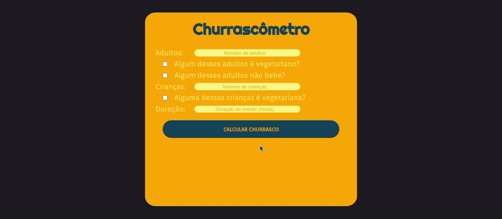
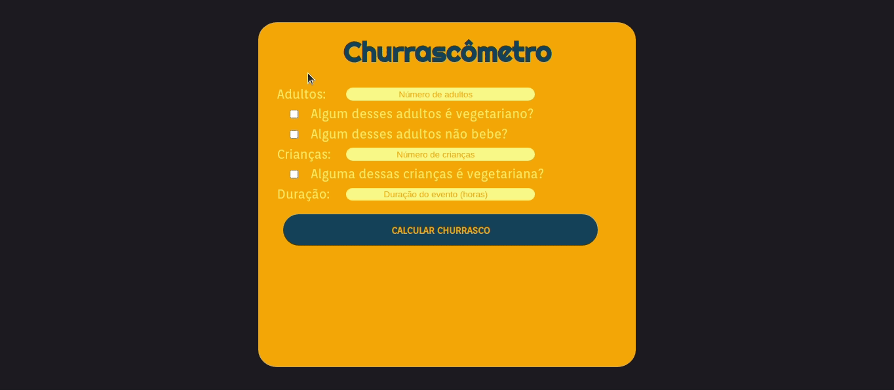

<h1 align="center">
 
    
 
 
CHURRASCÔMETRO
</h1>

A barbecue calculator inclusive to vegetarians and kids.

    
    
    

## Features

This project is perfect for a beginner dev who wants to test how simple habilits can create something more complex

- **JavaScript**
- **HTML**
- **CSS**

## Getting started

### You can use or modify this project yoursel following typing this code in your terminal:
#### git clone https://github.com/vallegabrielle/churrascometro.git
